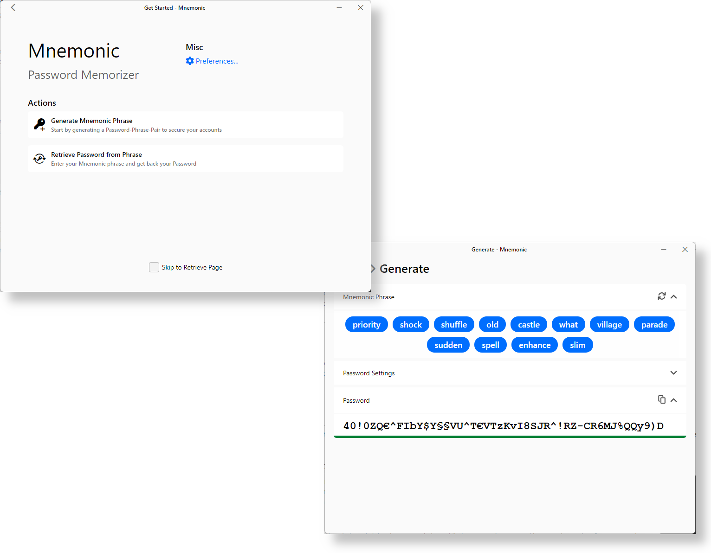

# Mnemonic - Password Memorizer

This application makes it easier to cope with modern-day password security standards by using a memorization technique similar to [Bitcoins](https://en.bitcoinwiki.org/wiki/Mnemonic_phrase).

## Screenshot
<p align="center">
  
</p>

## Description
Mnemonic Password Memorizer uses the technique of mnemonic phrasing to provide you with a much more memorable string of words. These words store all the information needed to recover your password and are cryptographically linked together. 

### Features
- Passwords between 8 and 88 characters
- Choose between four diffrent character groups
- Fast and Intuitive UI 
- Background service (with autolaunch)

Mnemonic´s frontend is written in Typescript (TSX) and SCSS using [Preact](https://preactjs.com/) as the major framework and [Vite](https://vitejs.dev/) as build tool. The backend is mostly Rust while the cryptographic part is Python (see at [crypto.py](resources/crypto.py)). The Rust backend is build upon [wry](https://github.com/tauri-apps/wry) and [tauri](https://github.com/tauri-apps/tauri).

## Installation

### Requirements (for operation)
- CPython >=3.10.0 [python.org](https://www.python.org/)
- Windows 7 or higher (only tested on Windows 10+11)

### Recomended Instrucions
1. Download the prebuild Application bundled in the `mnemonic-1.0.0-version.zip` and unpack it on your local machine in a static directory like `%localappdata%\Programs\Mnemonic`.

2. Create a shortcut form the executable to your Start Menu folder at `%appdata%\Microsoft\Windows\Start Menu\Programs\` and call it `Mnemonic - Password Memorizer`

3. Open the Applicaton the first time and Generate your Mnemonic Phrase. Add it to autolaunch in the prefrences.

## Building from Source on Windows

### Requirements
- Windows 7 or higher
- Rust via `rustup` from [rust-lang.org](https://www.rust-lang.org/tools/install)
- CPython >=3.10.0 from [python.org](https://www.python.org/)
- NodeJS and NPM from [nodejs.org](https://nodejs.org/en/download/)
- Git from [git-scm.com](https://git-scm.com/download/win)

### Perperation

Clone the Github Repository locally:
```bash
git clone "https://github.com/Tesafilm1337/Mnemonic.git"
cd Mnemonic
```

Install the required JavaScript dependecies in the web-app directory (the installation may take a while (depending on your internet connection)):
```bash
cd web-app
npm install .
```

### Building Debug

Start the development server for the frontend:
```bash
cd Mnemoinc/web-app
npx vite dev
```

Build and run the rust backend with cargo:
```bash
cd Mnemoinc
cargo run
# Go grab a coffee ☕ (Downloading + Building the fist time might take a while)
```

### Building Release build
```bash
cd Mnemoinc
cargo build --release
# Output in target/debug/mnemonic.exe
```

## Why only Windows?
As a single developer a build most of the Software just for the plaftform I am working the most with because of time issues. If somebody is intrested in porting it to another plaftform: contribution is always welcome.

## Wordlist
The wordlist is from electrum at [electrum/electrum/wordlist/english.txt](https://github.com/spesmilo/electrum/blob/master/electrum/wordlist/english.txt).

## Licence
Licensed under the [MIT](Licence.txt) license.


